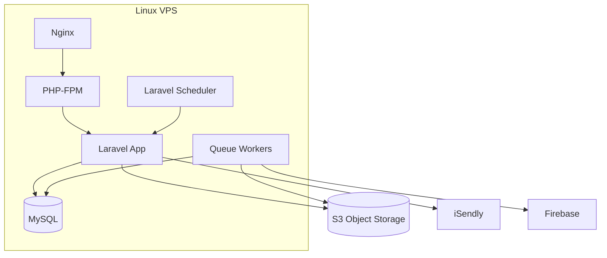
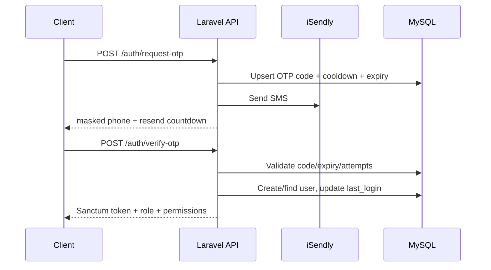
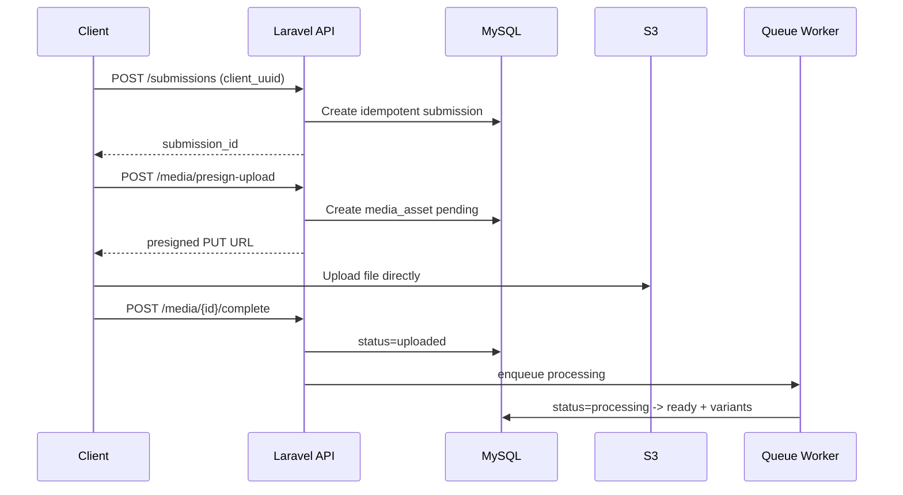
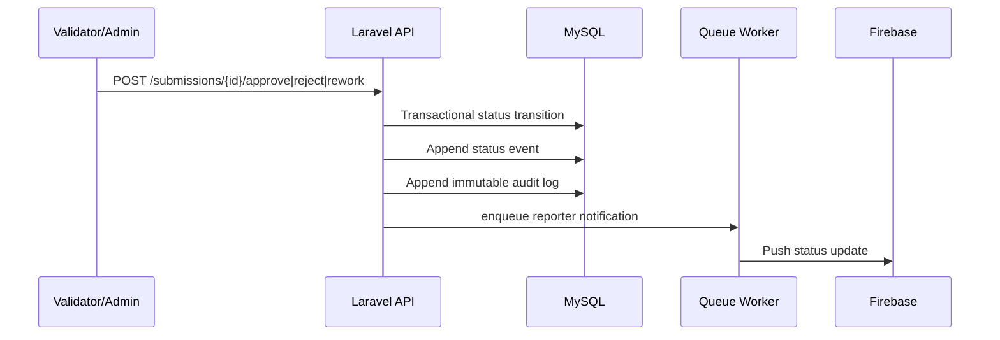

# UNDP Platform: Production Backend Architecture

Updated: February 19, 2026

## 1) Scope and Goal
This architecture covers **backend + web frontend (Vue.js)** for production deployment:
- Laravel API-first backend
- Vue 3 validation and dashboard portal
- RBAC and auditability
- Evidence media on S3-compatible object storage
- OTP login + status notifications

Mobile app implementation is intentionally out of scope in this repository, but backend APIs are designed to support it.

## 2) High-Level Principles
- API-first JSON contracts
- Least-privilege RBAC enforced server-side
- Stateless token auth for API clients
- Immutable audit logs for sensitive actions
- Municipality and ownership data isolation
- Arabic/English localization (`Accept-Language` + persisted user locale)

## 3) System Context
```mermaid
flowchart LR
    Reporter[Community Reporter Client]
    Validator[Validator / Municipal Web Portal (Vue)]
    Admin[UNDP Admin Web Portal (Vue)]
    Donor[Partner/Donor Read-Only Dashboard (Vue)]

    API[Laravel 12 API]
    DB[(MySQL)]
    Q[(Queue: DB/Redis)]
    S3[(AWS S3 Private Bucket)]
    OTP[iSendly OTP Provider]
    FCM[Firebase Cloud Messaging]

    Reporter --> API
    Validator --> API
    Admin --> API
    Donor --> API

    API --> DB
    API --> Q
    API --> S3
    API --> OTP
    API --> FCM
```

## 4) Runtime Containers


## 5) Authentication and RBAC

### Auth
- OTP request + verify endpoints (`/api/auth/request-otp`, `/api/auth/verify-otp`)
- Sanctum token issuance for API access
- Disabled user guard middleware revokes active token and blocks access
- OTP rate-limits (`otp` limiter) and API rate-limits (`api` limiter)

### RBAC Enforcement Layers
1. Middleware gatekeeping (`permission:*`, `active`)
2. Policy checks (`SubmissionPolicy`)
3. Query scoping (`SubmissionAccessService`)

This combination ensures routes, actions, and returned data all respect role scope.

## 6) Data Flow Diagrams

### 6.1 OTP Login


### 6.2 Submission + Media


### 6.3 Validation + Audit + Notification


## 7) Core Domain Modules
- `AuthController`: OTP lifecycle, token issue/revoke, device token registration
- `UserController`: create/edit/disable users, role assignment, user audit timeline
- `SubmissionController`: idempotent create, pending queue, workflow transitions, timeline
- `MediaController`: pre-signed upload/download and processing enqueue
- `DashboardController`: KPI, municipal, partner, and map datasets
- `AuditLogController`: immutable filtered audit access
- `ExportController`: CSV/PDF exports honoring current role scope

## 8) Data Model (Key Tables)
- `users` (role, status, municipality, locale, disable metadata)
- `submissions` (status, project, reporter, municipality, validation metadata, `client_uuid`)
- `submission_status_events` (timeline history)
- `media_assets` (S3 object metadata + processing state)
- `audit_logs` (append-only governance trail)
- `workflow_statuses`, `validation_reasons` (configurable workflow dictionary)
- Spatie RBAC tables (`roles`, `permissions`, pivots)

## 9) Production Hosting Plan (VPS + S3)
- Compute: VPS hosts Nginx, PHP-FPM, Laravel app, workers, scheduler, MySQL
- Storage: all user media exclusively in private S3 buckets
- Transfer: presigned URLs for upload/download after backend authorization
- Backend stores only media metadata and references

Recommended minimum:
- 2 vCPU / 8 GB RAM / 80 GB SSD VPS
- Queue workers separated by queue name (`default`, `notifications`, `media`)
- Nightly DB backup + S3 lifecycle policy

## 10) Security Controls
- TLS 1.2+ end-to-end
- Server-side permission enforcement on every protected route
- Token revocation on account disable
- Immutable audit table model-level protection
- Private buckets + short-lived signed URLs
- PII access limited to privileged roles

## 11) Observability and Ops
Track and alert on:
- API p95 latency
- Queue depth/failures by queue
- OTP delivery failures
- FCM failure rate
- S3 upload/processing failures
- 403 blocked-access events from `auth.blocked_permission`

## 12) Performance and Scale Strategy
- Stateless API nodes (horizontal scaling friendly)
- Queue offloading for notifications and media processing
- Indexed filtering/sorting on submissions and audit logs
- Chunked streaming for CSV exports

## 13) Current Gaps to Reach Full Production Maturity
1. Async export jobs with progress polling (current exports are synchronous request-response).
2. True media transcoding/thumbnail pipeline integration (current processing job is scaffolded placeholder).
3. Realtime dashboard/audit updates via broadcast channels or SSE.
4. Centralized metrics/log shipping (e.g., Prometheus + Loki/ELK).
5. DR runbook and tested restore drills.

## 14) Deployment Readiness Checklist
- [ ] Set MySQL production connection and backup policy
- [ ] Configure S3 credentials and private bucket policies
- [ ] Configure iSendly and FCM secrets
- [ ] Run `php artisan migrate --force`
- [ ] Start workers for `default`, `notifications`, `media`
- [ ] Enable scheduler (`* * * * * php artisan schedule:run`)
- [ ] Cache config/routes/views on deploy
- [ ] Enable HTTPS + HSTS
